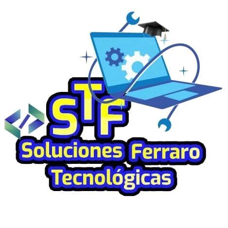

 

Hello I'm Gerardo Alí Ferraro Schelijasch .

T.S.U. (University Higher Technician) graduated from IUTEPI (University Institute of Technology for Informatics) in 2014. Currently, I am studying Engineering in Systems Analysis at the UNA (National Open University). Passionate about computing and technology, I work as a freelance web developer with knowledge in technologies such as HTML5 and CSS3, as well as tools like WordPress. I am also skilled in programming languages such as JAVA, C, C++, and Python. For the past year, I have also been collaborating as a junior developer in Odoo and Python at the company CorpoEureka.
My experience also includes technical support, with extensive knowledge in installing Windows operating systems and GNU/Linux distributions, setting up servers in GNU/Linux environments, and basic structured cabling and computer network setup for small businesses.
Currently, I work remotely as an Odoo and Python developer at Jenrax SRL in the Dominican Republic and as a university instructor teaching various subjects at IUTEPI (University Institute of Technology for Informatics).

## Skills and Technologies

- **Programming Languages**: Python, Java, JavaScript, C, C++
- **Frameworks and Tools**: Odoo, Django, FastAPI
- **Other**: SQL, PostgreSQL, MySQL, Git, GitHub

